# FitHub Architecture Diagrams

> [!NOTE]
> This document contains technical architecture diagrams for understanding the FitHub system design, data flows, and component interactions.

## System Architecture Overview

### High-Level Architecture

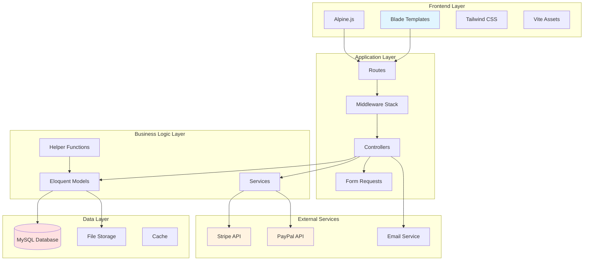

---

## Multi-Tenancy Architecture

### Tenant Isolation Pattern

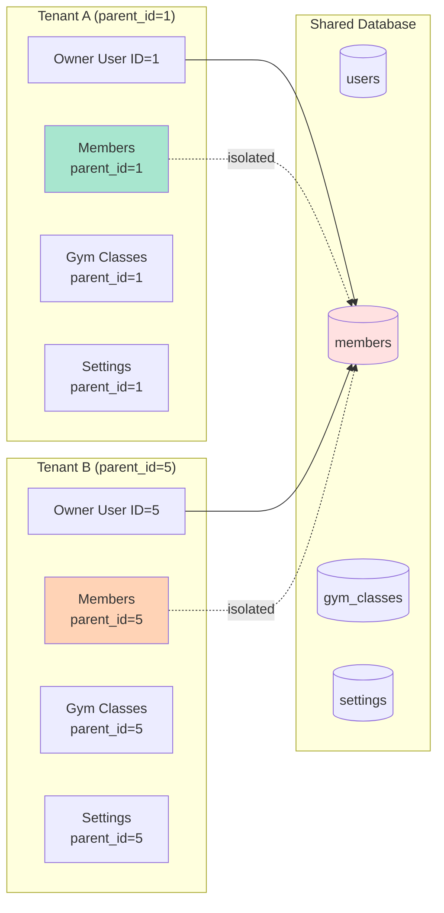

### Parent ID Scoping Flow

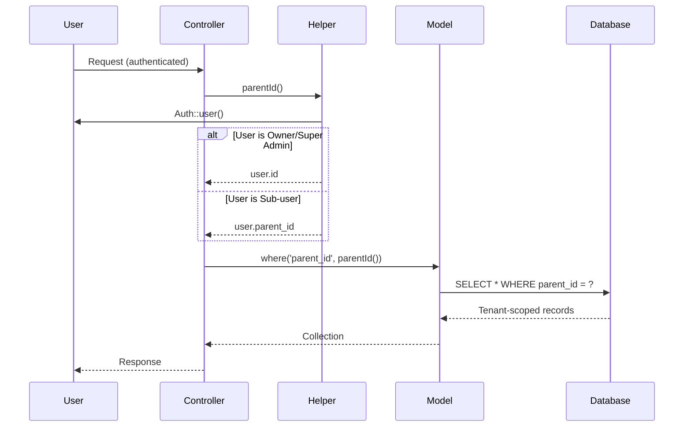

---

## Authentication Flow

### Login with 2FA Flow

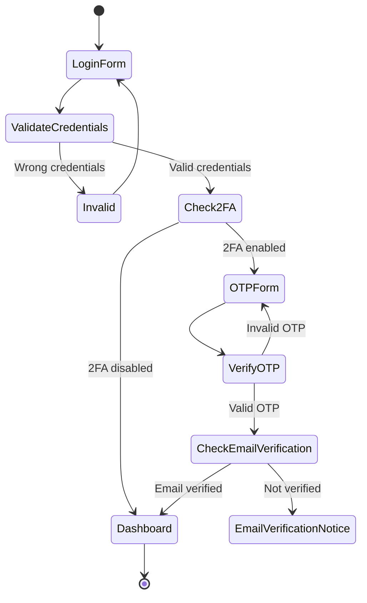

### Authentication Sequence

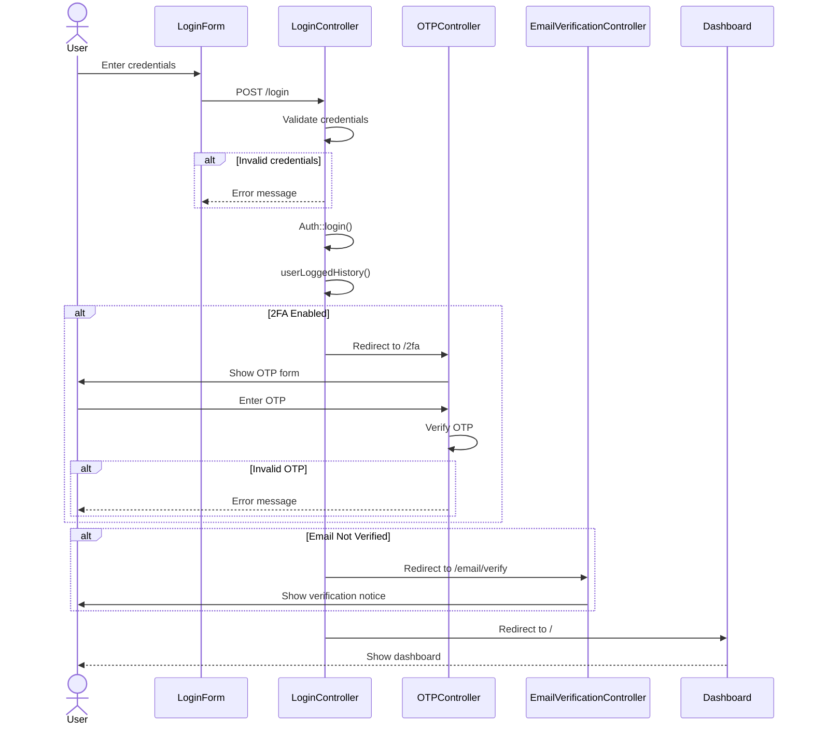

---

## Data Flow Diagrams

### Member Registration Flow

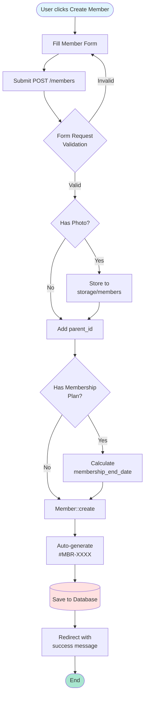

### Subscription Purchase Flow

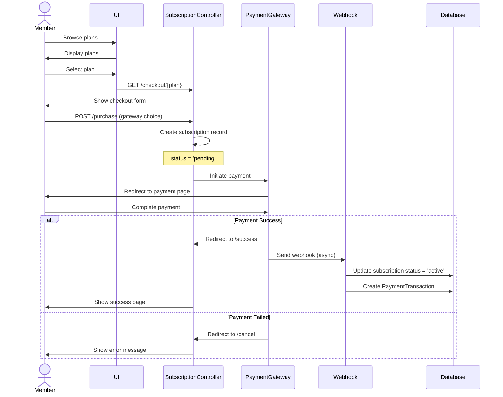

---

## Database Schema Diagrams

### Core Entity Relationships

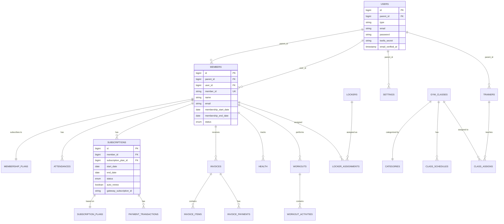

### Multi-Tenancy Schema

```mermaid
graph TB
    subgraph "All Tables with Multi-Tenancy"
        Members[members<br/>├ parent_id]
        Trainers[trainers<br/>├ parent_id]
        Classes[gym_classes<br/>├ parent_id]
        Categories[categories<br/>├ parent_id]
        Schedules[class_schedules<br/>├ parent_id]
        Attendances[attendances<br/>├ parent_id]
        Workouts[workouts<br/>├ parent_id]
        Health[healths<br/>├ parent_id]
        Invoices[invoices<br/>├ parent_id]
        Expenses[expenses<br/>├ parent_id]
        Lockers[lockers<br/>├ parent_id]
        Events[events<br/>├ parent_id]
        Notices[notice_boards<br/>├ parent_id]
        Settings[settings<br/>├ parent_id]
        Plans[membership_plans<br/>├ parent_id]
    end
    
    UsersTable[(users table)]
    
    UsersTable -->|parent_id FK| Members
    UsersTable -->|parent_id FK| Trainers
    UsersTable -->|parent_id FK| Classes
    UsersTable -->|parent_id FK| Categories
    UsersTable -->|parent_id FK| Schedules
    UsersTable -->|parent_id FK| Attendances
    UsersTable -->|parent_id FK| Workouts
    UsersTable -->|parent_id FK| Health
    UsersTable -->|parent_id FK| Invoices
    UsersTable -->|parent_id FK| Expenses
    UsersTable -->|parent_id FK| Lockers
    UsersTable -->|parent_id FK| Events
    UsersTable -->|parent_id FK| Notices
    UsersTable -->|parent_id FK| Settings
    UsersTable -->|parent_id FK| Plans
    
    style UsersTable fill:#ffe1e1
```

---

## State Machine Diagrams

### Subscription Lifecycle

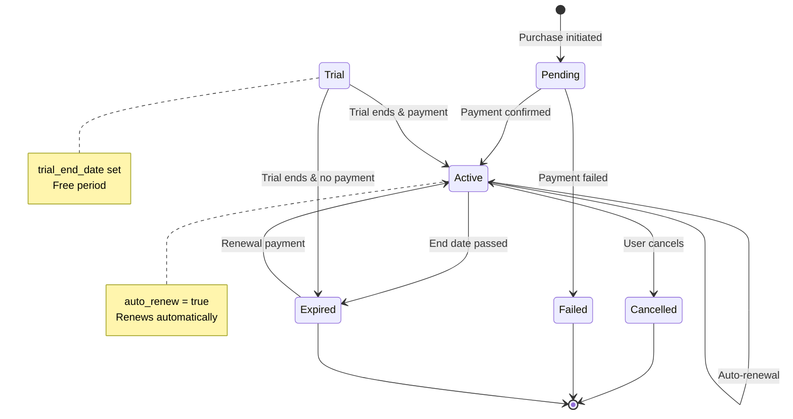

### Member Status Transitions

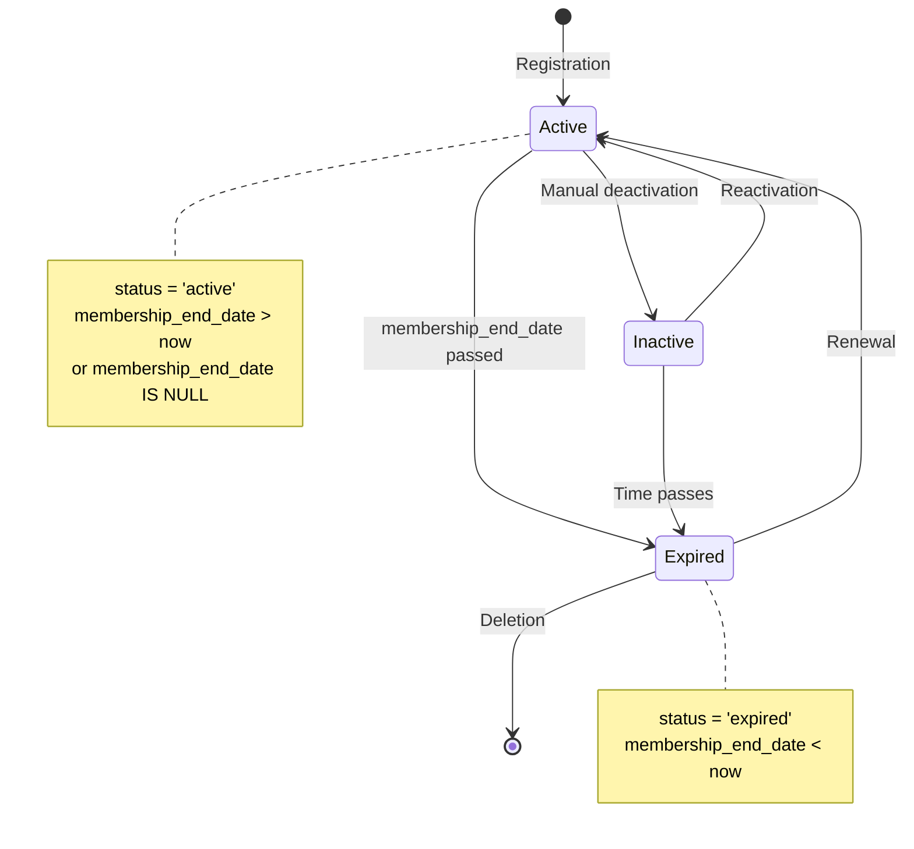

---

## Component Interaction Diagrams

### Request/Response Cycle

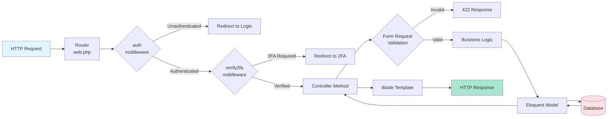

### Payment Gateway Integration

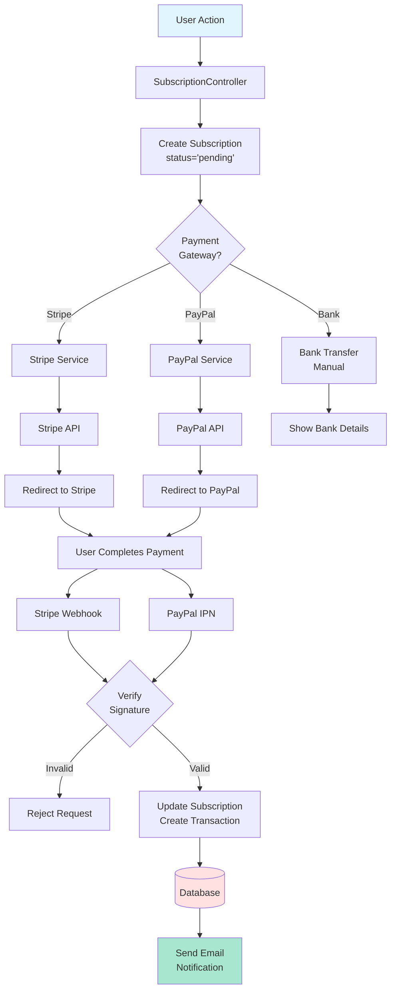

---

## Module Dependencies

### Service Layer Architecture

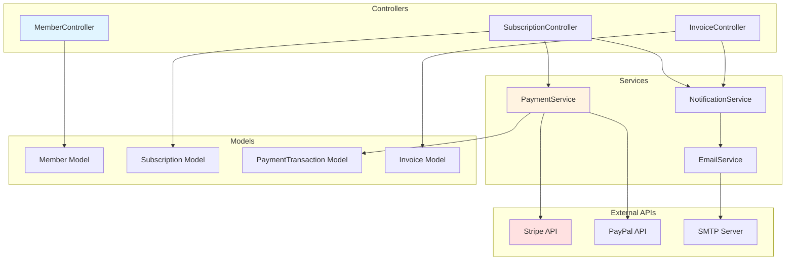

---

## Deployment Architecture

### Production Environment

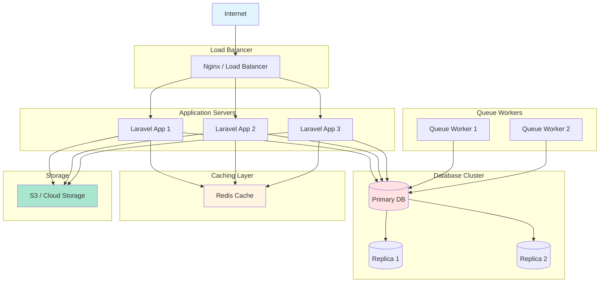

---

## Security Flow

### Authorization Check Flow

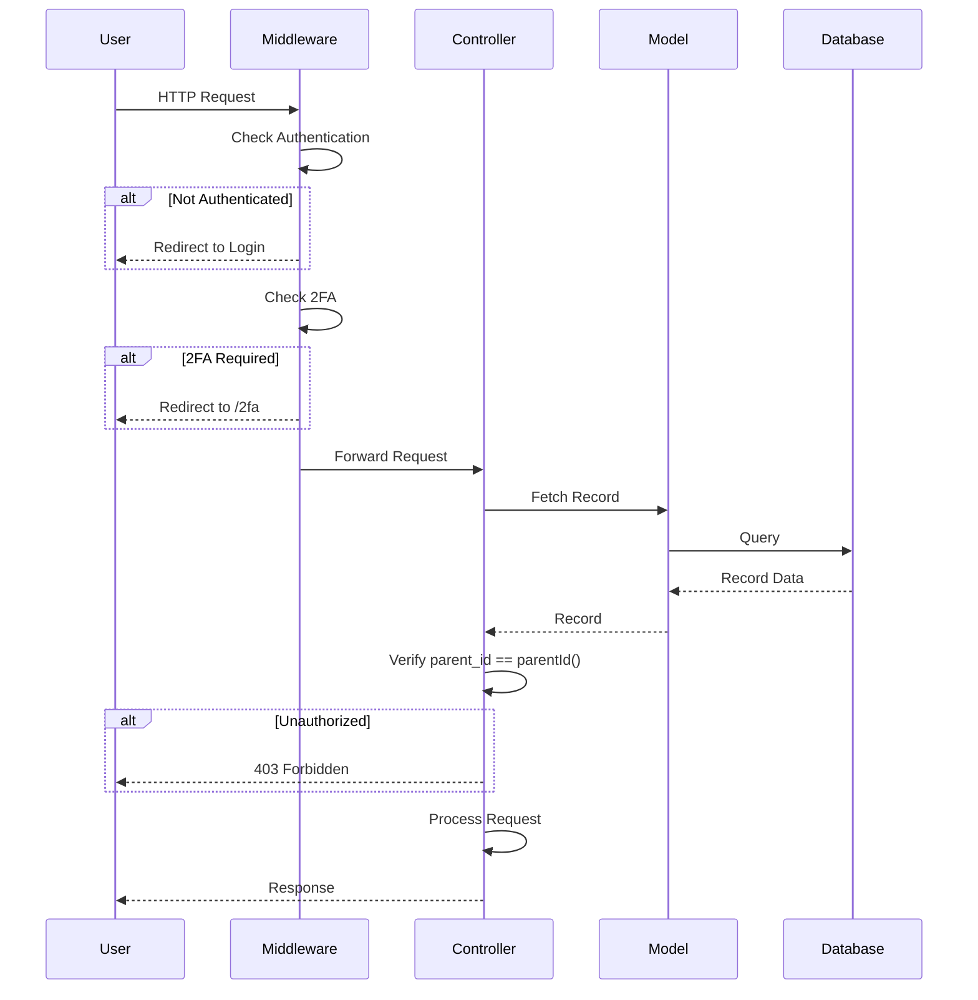

---

## Performance Optimization

### Query Optimization Pattern

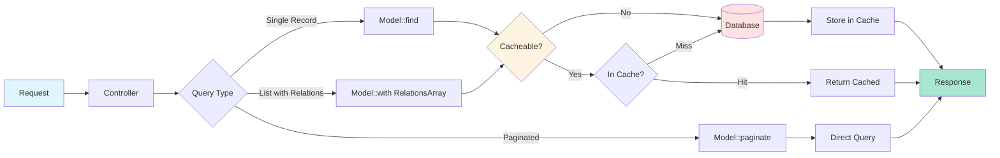

---

These diagrams provide visual representations of the FitHub system architecture. Use them to understand data flows, component interactions, and system design patterns. For code-level details, refer to the [CODEBASE_KNOWLEDGE_BASE.md](file:///Users/mujahid/.gemini/antigravity/brain/59b6e8bf-098f-40a8-a3e2-e5f1198a8ab0/CODEBASE_KNOWLEDGE_BASE.md).
