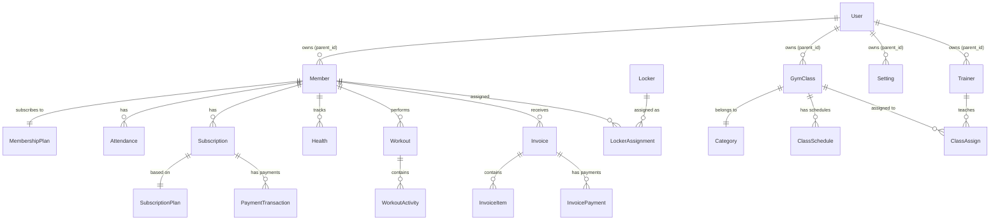

# FitHub Gym Management System - Codebase Knowledge Base

> [!IMPORTANT]
> This comprehensive knowledge base serves as a reference guide for understanding the FitHub Laravel-based gym management SaaS platform. It covers architecture, patterns, conventions, and key implementation details.

## Table of Contents

1. [Project Overview](#project-overview)
2. [Technology Stack](#technology-stack)
3. [Domain Model & Entities](#domain-model--entities)
4. [Multi-Tenancy Architecture](#multi-tenancy-architecture)
5. [Authentication & Security](#authentication--security)
6. [Payment Integration](#payment-integration)
7. [Key Business Rules](#key-business-rules)
8. [Module Structure](#module-structure)
9. [Helper Functions](#helper-functions)
10. [Testing Approach](#testing-approach)

---

## Project Overview

**FitHub** is a comprehensive gym management SaaS platform built with Laravel 12. It enables gym owners to manage members, trainers, classes, subscriptions, payments, and more through a unified dashboard.

### Core Purpose
- **Multi-tenant** gym management system
- **Subscription-based** revenue model
- **Comprehensive** member & trainer management
- **Integrated** payment processing (Stripe, PayPal, etc.)
- **Health & fitness** tracking capabilities

### Key Features
- Member management with auto-generated member IDs
- Trainer & class scheduling
- Attendance tracking & reporting
- Workout & health metrics logging
- Locker assignments
- Invoice & expense management
- Event & notice board
- Payment gateway integrations
- Email verification & 2FA
- Role-based permissions (via Spatie)

---

## Technology Stack

### Backend
- **Framework**: Laravel 12.x
- **PHP**: 8.2+
- **Authentication**: Laravel UI + Custom 2FA (Google2FA)
- **Authorization**: Spatie Laravel Permission 6.23
- **Database**: MySQL/PostgreSQL
- **Session**: Database-backed sessions

### Frontend
- **Template**: Velzon Admin Dashboard
- **CSS**: Tailwind CSS 3.x
- **JavaScript**: Alpine.js 2.x
- **Build Tool**: Vite
- **DataTables**: Yajra DataTables 12.6

### Payment Gateways
- **Stripe**: stripe-php 19.0
- **PayPal**: paypal/rest-api-sdk-php 1.6
- Support for Flutterwave, Paystack, Bank Transfer

### Testing
- **PHPUnit**: 11.0
- **Pest**: 3.0
- **Coverage**: Feature & Unit tests

---

## Domain Model & Entities

### Core Entities

#### Members Management
- **Member**: Core member entity with auto-generated `#MBR-XXXX` IDs
- **MembershipPlan**: Defines membership types, pricing, and duration
- **Subscription**: Tracks member subscriptions with trial & renewal support
- **Attendance**: Member check-in/check-out tracking

#### Trainers & Classes
- **Trainer**: Trainer profiles with specializations
- **Category**: Class categories (Yoga, CrossFit, etc.)
- **GymClass**: Class definitions with capacity limits
- **ClassSchedule**: Time-based class scheduling
- **ClassAssign**: Trainer-to-class assignments

#### Workouts & Health
- **Workout**: Workout session tracking
- **WorkoutActivity**: Individual exercises within workouts
- **Health**: Health metrics (weight, BMI, blood pressure, etc.)

#### Financial
- **Invoice**: Member invoicing with line items
- **InvoiceItem**: Individual invoice line items
- **InvoicePayment**: Payment records against invoices
- **Expense**: Business expense tracking
- **Type**: Expense categorization
- **PaymentTransaction**: Gateway payment records

#### Subscriptions & Payments
- **SubscriptionPlan**: SaaS subscription tiers
- **Subscription**: Active subscriptions with gateway IDs
- **PaymentTransaction**: Transaction history with gateway metadata

#### Facility Management
- **Locker**: Locker inventory
- **LockerAssignment**: Locker-to-member assignments
- **Event**: Gym events calendar
- **NoticeBoard**: Announcements & notices

#### Content & Settings
- **Page**: CMS pages (About, Terms, Privacy)
- **Setting**: Key-value configuration storage
- **ActivityLog**: System activity audit trail

#### Authentication
- **User**: System users with multi-tenancy support
- **LoggedHistory**: Login history tracking (IP, browser, OS, device)

### Entity Relationships



---

## Multi-Tenancy Architecture

### Tenant Isolation Strategy

FitHub implements **parent-based multi-tenancy**:

- Each gym owner is a `User` with `type = 'owner'` or `type = 'super admin'`
- All data records have a `parent_id` foreign key pointing to the owner
- Sub-users (staff, trainers) inherit their owner's `parent_id`

### Helper Function: `parentId()`

```php
function parentId(): ?int
{
    if (!Auth::check()) return null;
    
    $user = Auth::user();
    
    // Owners/admins use their own ID
    if ($user->type == 'owner' || $user->type == 'super admin') {
        return $user->id;
    }
    
    // Sub-users use their owner's ID
    return $user->parent_id;
}
```

### Data Scoping Pattern

All controllers follow this pattern:

```php
// Always scope queries by parent_id
$members = Member::where('parent_id', parentId())->get();

// Always verify ownership before mutations
if ($member->parent_id != parentId()) {
    abort(403, 'Unauthorized access');
}
```

### Settings Management

Settings are tenant-scoped using the `settings()` helper:

```php
// Get all settings for current tenant
$allSettings = settings();

// Get specific setting with default
$siteName = settings('site_name', 'FitHub');

// Settings are stored as key-value pairs with parent_id
```

---

## Authentication & Security

### Authentication Flow

1. **Login**: Standard email/password via `LoginController`
2. **2FA Check**: If enabled, redirect to `/2fa` for OTP verification via `OTPController`
3. **Email Verification**: Optional verification via `EmailVerificationController`
4. **Session**: User logged in and middleware applied

### Middleware Stack

- `auth`: Requires authenticated user
- `verify2fa`: Custom middleware for 2FA verification
- Routes grouped by middleware in `routes/web.php`

### Two-Factor Authentication (2FA)

- **Library**: pragmarx/google2fa-laravel
- **Storage**: `twofa_secret` column on `users` table
- **Enable**: `POST /2fa/enable` generates QR code
- **Verify**: `POST /2fa/verify` validates OTP
- **Disable**: `POST /2fa/disable` removes 2FA

### Email Verification

- Custom implementation (not Laravel's default)
- Verification codes stored in database
- Routes:
  - `GET /email/verify` - Show verification notice
  - `POST /email/verification-notification` - Resend email
  - `GET /email/verify/{code}` - Verify with code

### Login History Tracking

The `userLoggedHistory()` helper automatically logs:
- IP address
- Browser (Chrome, Firefox, Safari, etc.)
- Operating System (Windows, macOS, Linux, etc.)
- Device type (Desktop, Mobile, Tablet)
- Referer URL

Called after successful login to create audit trail.

### Permissions & Roles

- **Package**: Spatie Laravel Permission
- **Tables**: `roles`, `permissions`, `model_has_roles`, `model_has_permissions`
- **Usage**: Assign roles/permissions to users for RBAC

---

## Payment Integration

### Supported Gateways

1. **Stripe** - Card payments
2. **PayPal** - PayPal account payments
3. **Flutterwave** - African markets
4. **Paystack** - African markets
5. **Bank Transfer** - Manual verification

### Payment Flow

#### Subscription Purchase
1. User selects plan on `/subscriptions`
2. Redirects to `/subscriptions/{plan}/checkout`
3. User selects payment gateway
4. `POST /subscriptions/{plan}/purchase` processes payment
5. Gateway redirects to success/cancel URLs
6. Webhook confirms payment (async)

#### Webhook Handling
- `POST /webhooks/stripe` - Stripe webhook
- `POST /webhooks/paypal` - PayPal IPN
- Public routes (no auth) with signature verification
- Create/update `PaymentTransaction` records
- Activate `Subscription` on success

### Payment Transaction Model

Stores:
- `transaction_id` - Gateway transaction ID
- `payment_gateway` - stripe, paypal, etc.
- `amount`, `currency`
- `status` - pending, completed, failed, refunded
- `metadata` - JSON for gateway-specific data
- Relationships to `Subscription`, `Member`

---

## Key Business Rules

### Member ID Generation

Auto-generated on member creation:

```php
// Format: #MBR-0001, #MBR-0002, etc.
// Scoped per tenant (parent_id)
// Sequential numbering
// Generated in Member::boot() creating event
```

### Membership Expiry Calculation

```php
// From MembershipPlan model
public function calculateExpiryDate($startDate): Carbon
{
    return Carbon::parse($startDate)->addDays($this->duration_days);
}
```

### Active Member Definition

A member is considered active if:
- `status = 'active'` AND
- `membership_end_date` is null OR in the future

```php
// Member model
public function isActive(): bool
{
    return $this->status === 'active' && 
           (!$this->membership_end_date || $this->membership_end_date->isFuture());
}
```

### Subscription Renewal

```php
// Subscription model
public function renew(): void
{
    $this->start_date = $this->end_date->addDay();
    $this->end_date = $this->start_date->addDays($this->plan->duration_days);
    $this->status = 'active';
    $this->save();
}
```

### Auto-Renewal Logic

Subscriptions with `auto_renew = true` are automatically renewed via scheduled task (should be implemented in console kernel or command).

---

## Module Structure

### Controllers Organization

FitHub follows Laravel's resourceful controller pattern:

```
app/Http/Controllers/
├── Auth/
│   ├── LoginController.php
│   ├── OTPController.php
│   └── EmailVerificationController.php
├── AttendanceController.php
├── CategoryController.php
├── EventController.php
├── ExpenseController.php
├── GymClassController.php
├── HealthController.php
├── HomeController.php
├── InvoiceController.php
├── LockerController.php
├── MemberController.php
├── MembershipPlanController.php
├── NoticeBoardController.php
├── PageController.php
├── PaymentWebhookController.php
├── RoleController.php
├── SettingsController.php
├── SubscriptionController.php
├── TrainerController.php
├── TypeController.php
├── UserController.php
└── WorkoutController.php
```

### Route Grouping Pattern

Routes are organized by feature with common middleware:

```php
// Members Management
Route::middleware(['auth', 'verify2fa'])->group(function () {
    Route::resource('members', MemberController::class);
    Route::resource('membership-plans', MembershipPlanController::class);
});

// Financial Management
Route::middleware(['auth', 'verify2fa'])->group(function () {
    Route::resource('types', TypeController::class);
    Route::resource('invoices', InvoiceController::class);
    Route::resource('expenses', ExpenseController::class);
});
```

### Resource Controllers

Most controllers follow standard CRUD pattern:
- `index()` - List with filtering, search, pagination
- `create()` - Show creation form
- `store()` - Validate & create
- `show()` - Show single record
- `edit()` - Show edit form
- `update()` - Validate & update
- `destroy()` - Delete record

### Common Controller Patterns

#### Tenant Isolation Check
```php
if ($record->parent_id != parentId()) {
    abort(403, 'Unauthorized access');
}
```

#### File Upload Handling
```php
if ($request->hasFile('photo')) {
    if ($model->photo) {
        Storage::disk('public')->delete($model->photo);
    }
    $data['photo'] = $request->file('photo')->store('members', 'public');
}
```

#### Search & Filter Pattern
```php
$query = Model::where('parent_id', parentId());

if ($request->has('search')) {
    $query->where('name', 'like', "%{$request->search}%");
}

if ($request->has('status')) {
    $query->where('status', $request->status);
}

$records = $query->latest()->paginate(15);
```

---

## Helper Functions

### Location
All helpers are in `app/Helper/helper.php` (autoloaded via `composer.json`).

### Available Helpers

#### 1. `parentId(): ?int`
**Purpose**: Get the current user's tenant ID for multi-tenancy

**Returns**:
- Owner/Super Admin: their own `id`
- Sub-users: their `parent_id`
- Guest: `null`

**Usage**:
```php
$members = Member::where('parent_id', parentId())->get();
```

---

#### 2. `settings(?string $key = null, mixed $default = null): mixed`
**Purpose**: Retrieve tenant-scoped settings

**Parameters**:
- `$key` - Setting key (null for all settings)
- `$default` - Default value if not found

**Returns**:
- If `$key` is null: `stdClass` with all settings
- If `$key` provided: setting value or default

**Usage**:
```php
// Get all settings
$settings = settings();
echo $settings->site_name;

// Get specific setting
$logo = settings('site_logo', '/default-logo.png');
```

---

#### 3. `userLoggedHistory(): void`
**Purpose**: Log user login activity for security audit

**Tracks**:
- IP address
- Browser (Chrome, Firefox, Safari, Edge, Opera)
- OS (Windows, macOS, Linux, Android, iOS)
- Device (Desktop, Mobile, Tablet)
- Referer URL

**Called**: After successful login

**Storage**: `logged_histories` table

---

## Testing Approach

### Test Structure

```
tests/
├── Feature/       # Integration tests
└── Unit/          # Unit tests
```

### Testing Tools
- **PHPUnit 11**: Test runner
- **Pest 3**: Elegant test syntax
- **Laravel Testing**: HTTP tests, database factories

### Test Coverage Areas

1. **Authentication**
   - Login flow
   - 2FA verification
   - Email verification
   - Logout

2. **Multi-Tenancy**
   - Data isolation
   - Cross-tenant access prevention
   - Helper functions

3. **Member Management**
   - CRUD operations
   - Member ID generation
   - Membership expiry logic
   - Search & filtering

4. **Subscriptions**
   - Plan selection
   - Payment processing
   - Renewal logic
   - Cancellation

5. **Payment Webhooks**
   - Stripe webhook processing
   - PayPal IPN handling
   - Transaction creation
   - Subscription activation

### Common Test Patterns

#### Feature Test Example
```php
test('user can create member', function () {
    $user = User::factory()->create(['type' => 'owner']);
    $plan = MembershipPlan::factory()->create(['parent_id' => $user->id]);
    
    $this->actingAs($user)
        ->post(route('members.store'), [
            'name' => 'John Doe',
            'email' => 'john@example.com',
            'membership_plan_id' => $plan->id,
            // ... other fields
        ])
        ->assertRedirect(route('members.index'))
        ->assertSessionHas('success');
        
    $this->assertDatabaseHas('members', [
        'name' => 'John Doe',
        'parent_id' => $user->id,
    ]);
});
```

#### Unit Test Example
```php
test('member ID is auto-generated', function () {
    $member = Member::factory()->create();
    
    expect($member->member_id)
        ->toStartWith('#MBR-')
        ->toHaveLength(9);
});
```

---

## Additional Resources

### Documentation
The `docs/` directory contains:
- `technical/` - Technical documentation
  - Database Schema & ERD
  - Controllers & Routes Reference
  - Authentication & Security
  - Payment Integration Guide
  - Helper Functions Reference
  - Frontend UI Architecture
- `guides/` - User guides
- `project/` - Project planning docs

### Configuration Files
- `config/database.php` - Database connections
- `config/auth.php` - Authentication guards
- `config/session.php` - Session configuration
- `config/app.php` - Application settings

### Key Directories
- `app/Models/` - Eloquent models (28 files)
- `app/Http/Controllers/` - Controllers (23 files)
- `database/migrations/` - Database migrations (37 files)
- `database/factories/` - Model factories
- `database/seeders/` - Database seeders
- `resources/views/` - Blade templates
- `routes/web.php` - Web routes definition

---

## Development Workflow

### Setup
```bash
composer install
npm install
cp .env.example .env
php artisan key:generate
php artisan migrate --seed
npm run dev
php artisan serve
```

### Default Credentials
- **Email**: user@gmail.com
- **Password**: password

### Build Commands
- `npm run dev` - Development build with HMR
- `npm run build` - Production build
- `composer run dev` - Alias for npm run dev

### Testing Commands
```bash
php artisan test                    # Run all tests
php artisan test --filter=Member    # Run specific test
php artisan test --coverage         # With coverage report
```

---

## Code Conventions

### Naming Conventions
- **Models**: Singular, PascalCase (e.g., `Member`, `GymClass`)
- **Controllers**: Singular + `Controller` (e.g., `MemberController`)
- **Routes**: Plural, kebab-case (e.g., `gym-classes`, `notice-boards`)
- **Views**: Match route names (e.g., `resources/views/gym-classes/`)
- **Database**: Plural, snake_case (e.g., `gym_classes`, `notice_boards`)

### Laravel Conventions
- Use Eloquent relationships over raw queries
- Use Form Requests for validation
- Use resource controllers for CRUD
- Use route model binding
- Use eager loading to prevent N+1 queries

### Multi-Tenancy Conventions
- Always add `parent_id` to `fillable`
- Always scope queries by `parentId()`
- Always verify `parent_id` on show/edit/update/destroy
- Use factories with `parent_id` for testing

---

## Security Considerations

### Input Validation
- Form Requests for all store/update operations
- CSRF protection on all POST/PUT/DELETE routes
- XSS prevention via Blade escaping

### Authentication
- 2FA support for enhanced security
- Email verification option
- Login history tracking
- Password hashing via Laravel's bcrypt

### Authorization
- Multi-tenant data isolation via `parent_id`
- Spatie permissions for role-based access
- Explicit ownership checks in controllers

### File Uploads
- Validated file types and sizes
- Stored in `storage/app/public`
- Symlinked to `public/storage`
- Old files deleted on update

### Payment Security
- Webhook signature verification
- HTTPS required for production
- Gateway credentials in `.env`
- PCI compliance via gateway APIs

---

## Performance Optimization

### Database
- Eager loading relationships: `with('membershipPlan')`
- Pagination: `paginate(15)` instead of `get()`
- Indexes on foreign keys and frequently searched columns

### Caching
- Settings cached per tenant
- Config cached in production: `php artisan config:cache`
- Route cached: `php artisan route:cache`
- View compiled: `php artisan view:cache`

### Asset Management
- Vite for bundling and HMR
- Production build minifies assets
- CDN-ready asset URLs

---

## Common Tasks

### Adding a New Module

1. Create migration: `php artisan make:migration create_xyz_table`
2. Create model: `php artisan make:model Xyz`
3. Add `parent_id` to fillable and create relationship
4. Create controller: `php artisan make:controller XyzController --resource`
5. Add routes to `routes/web.php`
6. Create views in `resources/views/xyz/`
7. Create Form Requests for validation
8. Write tests

### Adding Settings

```php
// In controller or seeder
Setting::create([
    'parent_id' => $userId,
    'name' => 'new_setting_key',
    'value' => 'default_value',
]);

// Access via helper
$value = settings('new_setting_key', 'fallback');
```

### Adding Payment Gateway

1. Install SDK via Composer
2. Add configuration to `config/services.php`
3. Add credentials to `.env.example`
4. Create service class in `app/Services/`
5. Update `SubscriptionController::purchase()`
6. Create webhook handler in `PaymentWebhookController`
7. Add webhook route (no middleware)
8. Test with gateway sandbox

---

## Troubleshooting

### Common Issues

**Issue**: Frontend changes not reflected
**Solution**: Run `npm run build` or ensure `npm run dev` is running

**Issue**: 403 Unauthorized access
**Solution**: Check `parent_id` matches current user's tenant

**Issue**: Settings not found
**Solution**: Ensure settings seeded for the tenant

**Issue**: Payment webhook failing
**Solution**: Verify webhook URL is public, signature validation correct

**Issue**: Member ID not generating
**Solution**: Check `Member::boot()` method, ensure `parent_id` set

---

## Future Enhancements

Based on conversation history, potential additions:

- [ ] Notification system (email, SMS, push)
- [ ] Advanced reporting & analytics
- [ ] Mobile app API (Laravel Sanctum)
- [ ] Multi-location support per tenant
- [ ] Equipment inventory tracking
- [ ] Automated membership renewals
- [ ] Member mobile app
- [ ] Trainer scheduling optimization
- [ ] Integration with fitness trackers
- [ ] Advanced CMS for landing pages

---

## Conclusion

This knowledge base provides a comprehensive overview of the FitHub codebase. For specific implementation details, refer to:

- Technical documentation in `docs/technical/`
- Code comments in models and controllers
- Migration files for database schema
- Test files for expected behavior

When in doubt, follow existing patterns in sibling files and maintain consistency with the codebase conventions outlined above.
