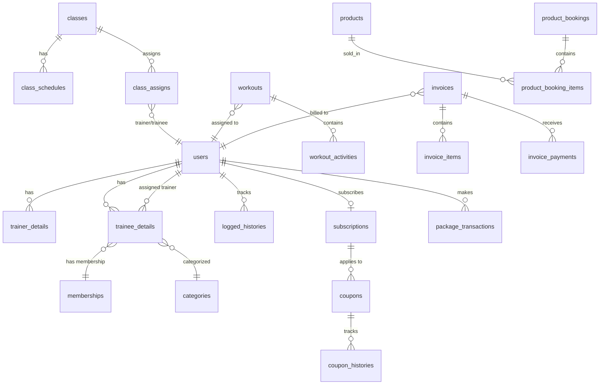

# Database Schema & Entity Relationship Diagram
## FitHub SaaS - Complete Database Reference

**Version**: 1.0  
**Date**: 2025-11-28  
**Total Tables**: 46  
**Database Engine**: MySQL 8.0+

---

## Overview

### Database Architecture
- **Multi-Tenancy**: Row-level isolation via `parent_id`
- **Isolation Strategy**: All tenant data filtered by `parent_id` = current user's owner ID
- **Storage Engine**: InnoDB
- **Character Set**: utf8mb4_unicode_ci

### Key Concepts
1. **parent_id**: Present in all business tables for multi-tenancy
2. **Soft Deletes**: Not used - hard deletes throughout
3. **Timestamps**: All tables have `created_at` and `updated_at`

---

## Migration Execution Order

**CRITICAL**: Migrations must run in this exact order due to foreign key dependencies.

```bash
# Phase 1: Foundation (Laravel defaults)
2014_10_12_000000_create_users_table
2014_10_12_100000_create_password_resets_table
2019_08_19_000000_create_failed_jobs_table

# Phase 2: Core System
2020_05_21_065337_create_permission_tables (Spatie)
2021_05_08_124950_create_settings_table
2021_05_08_100002_create_subscriptions_table

# Phase 3: Logging & Communication
2023_08_04_164513_create_logged_histories_table
2024_11_25_115027_create_notifications_table

# Phase 4: User Extensions
2024_01_18_131831_create_trainer_details_table
2024_01_18_131844_create_trainee_details_table
2024_09_16_094018_add_status_to_trainer_details_table
2024_09_16_113432_add_status_to_trainee_details_table
2025_02_05_065605_add_twofa_secret_to_users_table
2024_11_29_061023_add_email_verification_token_to_users_table

# Phase 5: Core Business Modules
2024_01_19_114136_create_categories_table
2024_01_19_055708_create_classes_table
2024_01_19_061950_create_class_schedules_table
2024_01_19_125612_create_class_assigns_table
2024_01_20_123246_create_memberships_table
2024_01_20_170028_create_workouts_table
2024_01_20_172155_create_workout_activities_table
2024_01_18_135347_create_healths_table
2024_01_22_112248_create_attendances_table

# Phase 6: Financial
2024_01_22_143323_create_types_table
2024_01_22_152120_create_invoices_table
2024_01_22_154448_create_invoice_items_table
2024_01_22_154716_create_invoice_payments_table
2024_01_22_175126_create_expenses_table

# Phase 7: Subscription & Payment
2024_02_17_052552_create_package_transactions_table
2024_01_12_141909_create_coupons_table
2024_01_12_171136_create_coupon_histories_table

# Phase 8: Additional Features
2025_07_22_114712_create_lockers_table
2025_07_23_033755_create_assign_lockers_table
2025_07_23_094909_create_events_table
2025_07_24_040129_create_event_types_table
2025_07_25_042246_create_nutrition_schedules_table
2025_07_26_094859_create_products_table
2025_07_28_051317_create_product_bookings_table
2025_07_28_061719_create_product_booking_items_table

# Phase 9: CMS
2021_05_29_180034_create_notice_boards_table
2021_05_29_183858_create_contacts_table
2025_01_01_032920_create_f_a_q_s_table
2025_01_01_052842_create_pages_table
2025_01_01_115236_create_home_pages_table
2025_01_30_090542_create_auth_pages_table

# Phase 10: Version Update
2025_07_18_095507_version_1_6_filled
```

---

## Entity Relationship Diagram



---

## Core Tables Detail

### 1. users
**Purpose**: Central authentication and user management  
**Multi-Tenancy**: `parent_id` (self-referencing)

| Column | Type | Nullable | Default | Description |
|--------|------|----------|---------|-------------|
| id | bigint unsigned | NO | AUTO_INCREMENT | Primary key |
| name | varchar(255) | NO | - | User full name |
| email | varchar(255) | NO | - | Unique email |
| email_verified_at | timestamp | YES | NULL | Email verification timestamp |
| password | varchar(255) | NO | - | Bcrypt hashed password |
| type | varchar(50) | NO | - | super admin, owner, trainer, trainee |
| phone_number | varchar(20) | YES | NULL | Contact number |
| profile | varchar(255) | YES | NULL | Profile image path |
| lang | varchar(10) | YES | 'en' | Language preference |
| subscription | int | YES | NULL | FK to subscriptions.id |
| subscription_expire_date | date | YES | NULL | Subscription expiry |
| parent_id | bigint unsigned | YES | NULL | Owner ID for multi-tenancy |
| is_active | tinyint | NO | 1 | Account status |
| twofa_secret | text | YES | NULL | 2FA secret key |
| twofa_enabled | tinyint | NO | 0 | 2FA toggle |
| code | varchar(255) | YES | NULL | Email verification token |

**Indexes**:
- PRIMARY KEY (id)
- UNIQUE (email)
- INDEX (parent_id)
- INDEX (type)
- INDEX (subscription)

**Relationships**:
- HasOne: trainerDetail, traineeDetail
- HasMany: loggedHistories
- BelongsTo: subscription (subscriptions table)

---

### 2. settings
**Purpose**: Multi-tenant configuration storage  
**Multi-Tenancy**: `parent_id`

| Column | Type | Nullable | Description |
|--------|------|----------|-------------|
| id | bigint unsigned | NO | Primary key |
| name | varchar(255) | NO | Setting key |
| value | text | YES | Setting value |
| type | varchar(50) | YES | common, payment, SEO, etc. |
| parent_id | bigint unsigned | YES | Tenant isolation |

**Indexes**:
- PRIMARY KEY (id)
- UNIQUE (name, parent_id, type)
- INDEX (parent_id)

---

### 3. subscriptions
**Purpose**: SaaS subscription plans  
**Multi-Tenancy**: No (global plans)

| Column | Type | Nullable | Description |
|--------|------|----------|-------------|
| id | bigint unsigned | NO | Primary key |
| title | varchar(255) | NO | Plan name |
| package_amount | decimal(10,2) | NO | Price |
| interval | varchar(50) | NO | Monthly, Quarterly, Yearly, Unlimited |
| user_limit | int | NO | Max users (0 = unlimited) |
| trainer_limit | int | NO | Max trainers |
| trainee_limit | int | NO | Max trainees |
| enabled_logged_history | tinyint | NO | Enable login history |

**Indexes**:
- PRIMARY KEY (id)

---

### 4. trainer_details
**Purpose**: Extended trainer information  
**Multi-Tenancy**: `parent_id`

| Column | Type | Nullable | Description |
|--------|------|----------|-------------|
| id | bigint unsigned | NO | Primary key |
| user_id | bigint unsigned | NO | FK to users.id |
| trainer_id | varchar(50) | NO | Auto-generated ID (#TRNR-000X) |
| address | text | YES | Address |
| city | varchar(100) | YES | City |
| state | varchar(100) | YES | State |
| country | varchar(100) | YES | Country |
| zip_code | varchar(20) | YES | Postal code |
| dob | date | YES | Date of birth |
| gender | varchar(20) | YES | Male/Female |
| qualification | text | YES | Certifications |
| document | varchar(255) | YES | Document file path |
| status | tinyint | NO | 1=Active, 0=Inactive |
| parent_id | bigint unsigned | YES | Tenant ID |

**Indexes**:
- PRIMARY KEY (id)
- UNIQUE (trainer_id)
- INDEX (user_id)
- INDEX (parent_id)

---

### 5. trainee_details
**Purpose**: Extended trainee/member information  
**Multi-Tenancy**: `parent_id`

| Column | Type | Nullable | Description |
|--------|------|----------|-------------|
| id | bigint unsigned | NO | Primary key |
| user_id | bigint unsigned | NO | FK to users.id |
| trainee_id | varchar(50) | NO | Auto-generated ID (#TRNE-000X) |
| address | text | YES | Address |
| city | varchar(100) | YES | City |
| state | varchar(100) | YES | State |
| country | varchar(100) | YES | Country |
| zip_code | varchar(20) | YES | Postal code |
| dob | date | YES | Date of birth |
| age | int | YES | Calculated age |
| fitness_goal | text | YES | Member goal |
| membership_plan | int | YES | FK to memberships.id |
| trainer_assign | bigint unsigned | YES | FK to users.id (trainer) |
| membership_start_date | date | YES | Membership start |
| membership_expiry_date | date | YES | Membership expiry |
| gender | varchar(20) | YES | Male/Female |
| assign_class | text | YES | Comma-separated class IDs |
| document | varchar(255) | YES | Document file path |
| category | int | YES | FK to categories.id |
| status | tinyint | NO | 1=Active, 0=Inactive |
| parent_id | bigint unsigned | YES | Tenant ID |

**Indexes**:
- PRIMARY KEY (id)
- UNIQUE (trainee_id)
- INDEX (user_id)
- INDEX (membership_plan)
- INDEX (trainer_assign)
- INDEX (parent_id)

---

### 6. classes
**Purpose**: Fitness class management  
**Multi-Tenancy**: `parent_id`

| Column | Type | Nullable | Description |
|--------|------|----------|-------------|
| id | bigint unsigned | NO | Primary key |
| title | varchar(255) | NO | Class name |
| fees | decimal(10,2) | YES | Class fee |
| address | text | YES | Venue |
| notes | text | YES | Description |
| parent_id | bigint unsigned | YES | Tenant ID |

**Relationships**:
- HasMany: classSchedule, classAssignTrainer, classAssignTrainee

---

### 7. class_schedules
**Purpose**: Class timing schedules  
**Multi-Tenancy**: Via classes.parent_id

| Column | Type | Nullable | Description |
|--------|------|----------|-------------|
| id | bigint unsigned | NO | Primary key |
| classes_id | bigint unsigned | NO | FK to classes.id |
| days | varchar(50) | NO | Day of week |
| start_time | time | NO | Start time |
| end_time | time | NO | End time |

---

### 8. class_assigns
**Purpose**: Trainer/trainee class assignments  
**Multi-Tenancy**: Via classes.parent_id

| Column | Type | Nullable | Description |
|--------|------|----------|-------------|
| id | bigint unsigned | NO | Primary key |
| classes_id | bigint unsigned | NO | FK to classes.id |
| assign_id | bigint unsigned | NO | FK to users.id |
| assign_type | varchar(20) | NO | 'trainer' or 'trainee' |

---

### 9. memberships
**Purpose**: Membership plan templates  
**Multi-Tenancy**: `parent_id`

| Column | Type | Nullable | Description |
|--------|------|----------|-------------|
| id | bigint unsigned | NO | Primary key |
| title | varchar(255) | NO | Plan name |
| package | varchar(50) | NO | monthly, quarterly, half_yearly, yearly, lifetime |
| amount | decimal(10,2) | NO | Price |
| classes_id | text | YES | Comma-separated class IDs |
| notes | text | YES | Description |
| parent_id | bigint unsigned | YES | Tenant ID |

---

### 10. invoices
**Purpose**: Income invoice management  
**Multi-Tenancy**: `parent_id`

| Column | Type | Nullable | Description |
|--------|------|----------|-------------|
| id | bigint unsigned | NO | Primary key |
| invoice_id | varchar(50) | NO | Auto-generated (#INV-000X) |
| user_id | bigint unsigned | NO | FK to users.id (trainee) |
| invoice_date | date | NO | Issue date |
| invoice_due_date | date | NO | Due date |
| status | varchar(20) | NO | unpaid, paid, partial_paid |
| notes | text | YES | Additional notes |
| parent_id | bigint unsigned | YES | Tenant ID |

**Relationships**:
- HasMany: types (invoice_items), payments (invoice_payments)
- BelongsTo: users

---

### 11. invoice_items
**Purpose**: Invoice line items  
**Multi-Tenancy**: Via invoices.parent_id

| Column | Type | Nullable | Description |
|--------|------|----------|-------------|
| id | bigint unsigned | NO | Primary key |
| invoice_id | bigint unsigned | NO | FK to invoices.id |
| description | text | NO | Item description |
| quantity | int | NO | Quantity |
| rate | decimal(10,2) | NO | Unit price |
| amount | decimal(10,2) | NO | Calculated (quantity × rate) |

---

### 12. invoice_payments
**Purpose**: Payment records for invoices  
**Multi-Tenancy**: Via invoices.parent_id

| Column | Type | Nullable | Description |
|--------|------|----------|-------------|
| id | bigint unsigned | NO | Primary key |
| invoice_id | bigint unsigned | NO | FK to invoices.id |
| payment_date | date | NO | Payment date |
| amount | decimal(10,2) | NO | Payment amount |
| payment_method | varchar(50) | YES | Cash, Card, Bank Transfer |
| reference | varchar(255) | YES | Transaction reference |
| notes | text | YES | Additional notes |

---

### 13. package_transactions
**Purpose**: SaaS subscription payment records  
**Multi-Tenancy**: No (super admin level)

| Column | Type | Nullable | Description |
|--------|------|----------|-------------|
| id | bigint unsigned | NO | Primary key |
| user_id | bigint unsigned | NO | FK to users.id (owner) |
| subscription_id | bigint unsigned | NO | FK to subscriptions.id |
| subscription_transactions_id | varchar(255) | YES | Gateway transaction ID |
| amount | decimal(10,2) | NO | Amount paid |
| transaction_id | varchar(255) | YES | Internal transaction ID |
| payment_status | varchar(50) | NO | Success, Pending, Rejected |
| payment_type | varchar(50) | NO | Stripe, PayPal, Bank Transfer, etc. |
| receipt | varchar(255) | YES | Receipt file path (bank transfer) |
| holder_name | varchar(255) | YES | Cardholder name |
| card_number | varchar(4) | YES | Last 4 digits |
| card_expiry_month | varchar(2) | YES | Expiry month |
| card_expiry_year | varchar(4) | YES | Expiry year |

---

### 14. coupons
**Purpose**: Discount coupon management  
**Multi-Tenancy**: No (global)

| Column | Type | Nullable | Description |
|--------|------|----------|-------------|
| id | bigint unsigned | NO | Primary key |
| name | varchar(255) | NO | Coupon name |
| type | varchar(20) | NO | 'fixed' or 'percentage' |
| rate | decimal(10,2) | NO | Discount value |
| applicable_packages | text | YES | Comma-separated subscription IDs |
| code | varchar(50) | NO | Unique coupon code |
| valid_for | date | YES | Expiry date |
| use_limit | int | YES | Maximum uses |
| status | tinyint | NO | 0=Inactive, 1=Active |

---

## Additional Tables Summary

### CMS Tables
- **pages**: Custom pages
- **home_pages**: Landing page content
- **auth_pages**: Login/register page customization
- **f_a_q_s**: FAQ management

### Communication
- **contacts**: Contact form submissions
- **notice_boards**: Internal announcements
- **notifications**: Email template configuration

### Health & Fitness
- **healths**: Health measurements (JSON storage)
- **workouts**: Workout plans
- **workout_activities**: Exercise details
- **nutrition_schedules**: Meal plans
- **attendances**: Daily attendance

### Operations
- **lockers**: Locker inventory
- **assign_lockers**: Locker assignments
- **events**: Calendar events
- **event_types**: Event categories
- **products**: Product catalog
- **product_bookings**: Product sales
- **product_booking_items**: Sale line items

### System
- **logged_histories**: Login tracking
- **types**: Invoice/expense categories
- **expenses**: Expense records
- **categories**: Class categories

---

## Important Notes

### Multi-Tenancy Implementation
```php
// All queries must include:
->where('parent_id', parentId())

// parentId() helper returns:
// - For owner/super admin: own user ID
// - For trainer/trainee: owner's user ID
```

### Foreign Key Conventions
- All FK columns are named: `{table}_id`
- Exception: `parent_id` (tenant isolation)
- No ON DELETE CASCADE (managed in application layer)

### Auto-Generated IDs
Format: `#{PREFIX}-{SEQUENCE}`
- Trainers: `#TRNR-0001`
- Trainees: `#TRNE-0001`
- Invoices: `#INV-0001`
- Expenses: `#EXP-0001`
- Lockers: `#LO-0001`

Generated via helper functions in `app/Helper/helper.php`

---

**Document Version**: 1.0  
**Last Updated**: 2025-11-28  
**Next Document**: Controllers & Routes Reference
