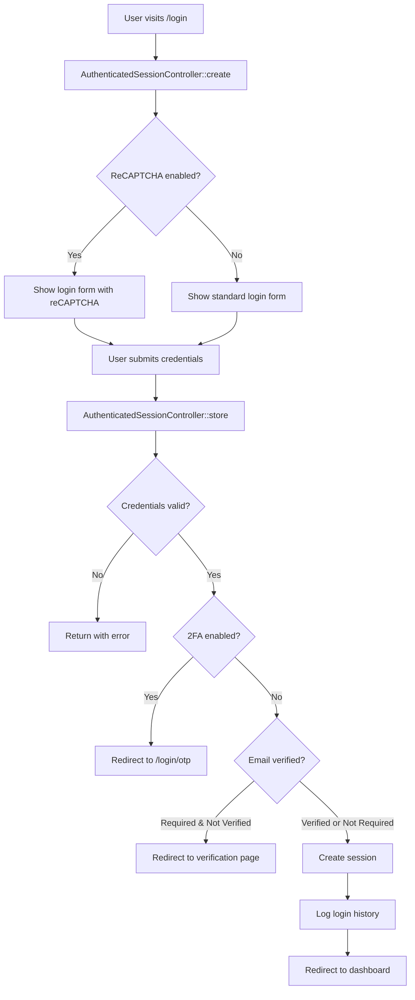
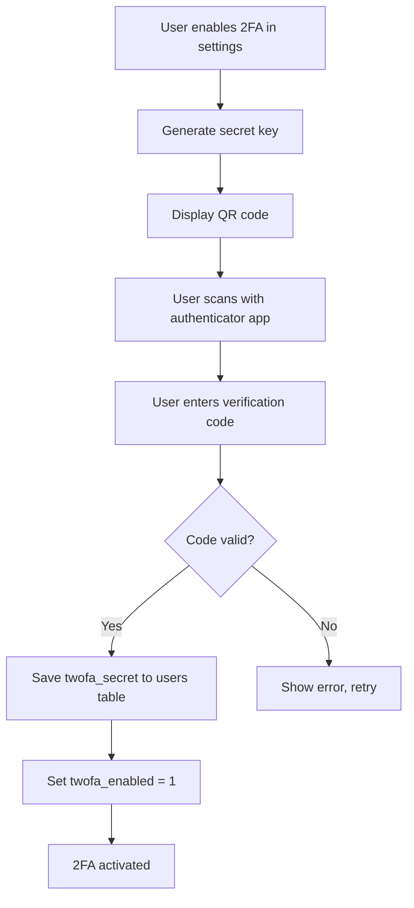
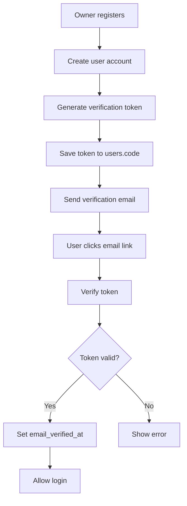
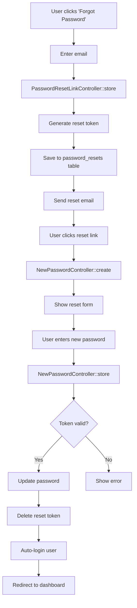

# Authentication & Security Architecture
## FitHub SaaS - Security Implementation Guide

**Version**: 1.0  
**Date**: 2025-11-28

---

## Overview

### Security Layers
1. **Authentication**: Laravel Sanctum + Session-based
2. **Authorization**: Spatie Laravel Permission (roles & permissions)
3. **Two-Factor Authentication**: Google2FA
4. **XSS Protection**: Custom middleware  
5. **CSRF Protection**: Laravel built-in
6. **Email Verification**: Optional token-based system
7. **ReCAPTCHA**: Google reCAPTCHA v2
8. **Password Security**: Bcrypt hashing

---

## 1. Authentication System

### 1.1 Login Flow



### 1.2 Login Implementation

**Controller**: `app/Http/Controllers/Auth/AuthenticatedSessionController.php`

```php
public function store(LoginRequest $request)
{
    // Validate ReCAPTCHA if enabled
    if (settings()->recaptcha_enable == 'on') {
        $validator = Validator::make($request->all(), [
            'g-recaptcha-response' => 'required|captcha',
        ]);
        
        if ($validator->fails()) {
            return redirect()->back()->with('error', 'Invalid reCAPTCHA');
        }
    }
    
    // Attempt authentication
    $request->authenticate();
    
    $request->session()->regenerate();
    
    $user = Auth::user();
    
    // Check 2FA
    if ($user->twofa_enabled == 1) {
        return redirect()->route('login.otp');
    }
    
    // Check email verification
    if (settings()->owner_email_verification == 'on' && 
        $user->type == 'owner' && 
        !$user->email_verified_at) {
        Auth::logout();
        return redirect()->back()->with('error', 'Email not verified');
    }
    
    // Log login history
    userLoggedHistory();
    
    return redirect()->intended(route('home'));
}
```

### 1.3 User Login History

**Table**: `logged_histories`

**Tracked Data**:
- IP address
- Browser (User Agent)
- Operating System
- Device type (mobile/tablet/desktop)  
- Geographic location (from IP)
- Referrer URL
- Login timestamp

**Implementation**: `app/Helper/helper.php`

```php
function userLoggedHistory()
{
    $user = Auth::user();
    
    LoggedHistory::create([
        'user_id' => $user->id,
        'ip' => request()->ip(),
        'country' => getLocationFromIP(request()->ip()),
        'browser' => getBrowser(request()->header('User-Agent')),
        'os' => getOS(request()->header('User-Agent')),
        'device' => User::getDevice(request()->header('User-Agent')),
        'referer' => request()->headers->get('referer'),
        'created_at' => now(),
    ]);
}
```

---

## 2. Two-Factor Authentication (2FA)

### 2.1 Implementation Stack
- **Package**: `pragmarx/google2fa-laravel`
- **Type**: TOTP (Time-based One-Time Password)
- **App Support**: Google Authenticator, Authy, Microsoft Authenticator

### 2.2 2FA Enrollment Flow



### 2.3 Configuration

**File**: `config/google2fa.php`

```php
return [
    'enabled' => true,
    'window' => 4,  // Time window for code validity
    'qrcode_image_backend' => 'imagemagick',
];
```

### 2.4 2FA Verification Middleware

**File**: `app/Http/Middleware/Verify2FA.php`

```php
public function handle($request, Closure $next)
{
    $user = Auth::user();
    
    if ($user && $user->twofa_enabled == 1) {
        if (!session('2fa_verified')) {
            return redirect()->route('login.otp');
        }
    }
    
    return $next($request);
}
```

### 2.5 OTP Verification

**Controller**: `app/Http/Controllers/OTPController.php`

```php
public function check(Request $request)
{
    $user = Auth::user();
    $google2fa = app('pragmarx.google2fa');
    
    $valid = $google2fa->verifyKey($user->twofa_secret, $request->otp);
    
    if ($valid) {
        session(['2fa_verified' => true]);
        return redirect()->route('home');
    }
    
    return redirect()->back()->with('error', 'Invalid OTP code');
}
```

### 2.6 2FA Disable

```php
public function disable2FA()
{
    $user = Auth::user();
    $user->twofa_enabled = 0;
    $user->twofa_secret = null;
    $user->save();
    
    return redirect()->back()->with('success', '2FA disabled');
}
```

---

## 3. Email Verification

### 3.1 Configuration

**Settings Key**: `owner_email_verification` (on/off)

Only applies to **owner** accounts during registration.

### 3.2 Email Verification Flow



### 3.3 Verification Email

**Mailer**: `app/Mail/EmailVerification.php`

```php
class EmailVerification extends Mailable
{
    public $user;
    public $token;
    
    public function __construct($user, $token)
    {
        $this->user = $user;
        $this->token = $token;
    }
    
    public function build()
    {
        $url = route('email.verify', ['token' => $this->token]);
        
        return $this->subject('Verify Your Email')
                    ->view('emails.verify-email')
                    ->with(['url' => $url]);
    }
}
```

### 3.4 Verification Route

```php
Route::get('/email-verification/{token}', function($token) {
    $user = User::where('code', $token)->first();
    
    if ($user) {
        $user->email_verified_at = now();
        $user->code = null;
        $user->save();
        
        return redirect()->route('login')->with('success', 'Email verified!');
    }
    
    return redirect()->route('login')->with('error', 'Invalid token');
});
```

---

## 4. Authorization (Roles & Permissions)

### 4.1 Spatie Permission Package

**Tables**:
- `roles`
- `permissions`
- `model_has_roles`
- `model_has_permissions`
- `role_has_permissions`

### 4.2 Default Roles

1. **Super Admin**
   - Full system access
   - Manage all owners
   - Subscription management
   - Impersonation capability

2. **Owner**
   - Gym-level administration
   - Manage trainers/trainees/staff
   - Financial operations
   - Settings configuration

3. **Trainer**
   - View assigned trainees
   - Manage classes (assigned)
   - Create workouts
   - Mark attendance
   - View health updates

4. **Trainee**
   - View personal data
   - View workouts
   - View health history
   - View attendance

### 4.3 Permission Structure

**Format**: `{action} {module}`

**Actions**: create, edit, delete, show, manage

**Modules** (from `User::$systemModules`):
```php
[
    'user', 'trainer', 'trainee', 'class', 'category',
    'workout', 'membership', 'health', 'attendance',
    'invoice', 'expense', 'finance type', 'notification',
    'contact', 'note', 'logged history', 'settings',
    'locker', 'event', 'nutrition schedule', 'product'
]
```

**Total Permissions**: ~100 (5 actions × 20 modules)

### 4.4 Permission Assignment

**Helper**: `defaultPermission()` in `app/Helper/helper.php`

```php
function defaultPermission($type)
{
    $permissions = [];
    
    if ($type == 'trainer') {
        $permissions = [
            'manage contacts',
            'manage notes',
            'show trainees',
            'manage classes',
            'manage workouts',
            'manage today workout',
            'manage health update',
            'manage attendance',
        ];
    } elseif ($type == 'trainee') {
        $permissions = [
            'manage contacts',
            'manage notes',
            'show trainers',
            'show classes',
            'show workouts',
            'manage today workout',
            'show health update',
            'show attendance',
        ];
    }
    
    return $permissions;
}
```

### 4.5 Permission Checking

**In Controllers**:
```php
if (\Auth::user()->can('create trainer')) {
    // Allow action
} else {
    return redirect()->back()->with('error', __('Permission Denied.'));
}
```

**In Blade Templates**:
```blade
@can('edit invoice')
    <a href="{{ route('invoice.edit', $invoice->id) }}">Edit</a>
@endcan
```

---

## 5. XSS Protection

### 5.1 Custom XSS Middleware

**File**: `app/Http/Middleware/XSS.php` (131 lines, 4,377 bytes)

**Purpose**: Sanitize all input to prevent cross-site scripting attacks

### 5.2 Implementation

```php
public function handle($request, Closure $next)
{
    $input = $request->all();
    
    array_walk_recursive($input, function(&$input) {
        $input = strip_tags($input);
        $input = htmlspecialchars($input, ENT_QUOTES, 'UTF-8');
    });
    
    $request->merge($input);
    
    return $next($request);
}
```

### 5.3 Middleware Application

**Routes**: Applied to all authenticated routes
```php
Route::middleware(['auth', 'XSS'])->group(function () {
    // All application routes
});
```

---

## 6. CSRF Protection

### 6.1 Laravel Built-in

**Middleware**: `VerifyCsrfToken`

**Token Generation**: Automatic for all sessions

**Blade Templates**:
```blade
<form method="POST" action="/route">
    @csrf
    <!-- form fields -->
</form>
```

**AJAX Requests**:
```javascript
$.ajaxSetup({
    headers: {
        'X-CSRF-TOKEN': $('meta[name="csrf-token"]').attr('content')
    }
});
```

---

## 7. Google reCAPTCHA

### 7.1 Configuration

**Package**: `anhskohbo/no-captcha`

**File**: `config/captcha.php`

```php
return [
    'secret' => env('NOCAPTCHA_SECRET'),
    'sitekey' => env('NOCAPTCHA_SITEKEY'),
    'options' => [
        'timeout' => 30,
    ],
];
```

### 7.2 Settings Integration

Stored in `settings` table:
- `recaptcha_key` (site key)
- `recaptcha_secret` (secret key)
- `recaptcha_enable` (on/off)

**Dynamic Configuration** in `SettingController`:
```php
config([
    'captcha.secret' => $settings['recaptcha_secret'],
    'captcha.sitekey' => $settings['recaptcha_key'],
]);
```

### 7.3 Form Implementation

**Blade**:
```blade
@if($settings['recaptcha_enable'] == 'on')
    {!! NoCaptcha::display() !!}
@endif
```

**Validation**:
```php
[
    'g-recaptcha-response' => 'required|captcha',
]
```

---

## 8. Password Security

### 8.1 Hashing

**Algorithm**: Bcrypt (Laravel default)

**Configuration**: `config/hashing.php`
```php
'bcrypt' => [
    'rounds' => 10,
],
```

### 8.2 Password Requirements

**Minimum Length**: 6 characters (configurable)

**Validation**:
```php
[
    'password' => 'required|min:6|confirmed',
]
```

### 8.3 Password Reset Flow



---

## 9. Impersonation

### 9.1 Package
**Package**: `lab404/laravel-impersonate`

**Configuration**: `config/laravel-impersonate.php`

### 9.2 Implementation

**User Model**:
```php
use Lab404\\Impersonate\\Models\\Impersonate;

class User extends Authenticatable
{
    use Impersonate;
    
    public function canImpersonate()
    {
        return $this->type == 'super admin';
    }
    
    public function canBeImpersonated()
    {
        return $this->type != 'super admin';
    }
}
```

**Routes**:
```php
Route::impersonate();  // Adds /impersonate/{id} and /impersonate/leave
```

**Usage**:
```blade
@can('impersonate', $user)
    <a href="{{ route('impersonate', $user->id) }}">Impersonate</a>
@endcan
```

---

## 10. Security Best Practices

### 10.1 Environment Variables

**.env File** (never commit to version control):
```env
APP_KEY=base64:...
DB_PASSWORD=...
STRIPE_SECRET=...
PAYPAL_SECRET=...
```

### 10.2 SQL Injection Prevention

**Always use parameter binding**:
```php
// Correct
User::where('email', $email)->first();

// Also correct
DB::select('SELECT * FROM users WHERE email = ?', [$email]);

// WRONG - vulnerable to SQL injection
DB::select("SELECT * FROM users WHERE email = '$email'");
```

### 10.3 Mass Assignment Protection

**Define fillable fields**:
```php
protected $fillable = ['name', 'email'];
```

**Or use guarded**:
```php
protected $guarded = ['id', 'password'];
```

### 10.4 Session Security

**Configuration**: `config/session.php`
```php
'secure' => env('SESSION_SECURE_COOKIE', false),  // true for HTTPS
'http_only' => true,
'same_site' => 'lax',
```

### 10.5 Headers Security

Add to `public/.htaccess`:
```apache
Header set X-Frame-Options "SAMEORIGIN"
Header set X-Content-Type-Options "nosniff"
Header set X-XSS-Protection "1; mode=block"
```

---

## 11. Security Checklist

### Production Deployment

- [ ] Set `APP_ENV=production`
- [ ] Set `APP_DEBUG=false`
- [ ] Use HTTPS (force in production)
- [ ] Enable rate limiting
- [ ] Configure proper file permissions (755 for directories, 644 for files)
- [ ] Exclude `.env` from version control
- [ ] Run `php artisan config:cache`
- [ ] Run `php artisan route:cache`
- [ ] Enable 2FA for all admin accounts
- [ ] Set strong `APP_KEY`
- [ ] Configure secure session cookies
- [ ] Set proper CORS policies
- [ ] Enable all security headers
- [ ] Regular security audits
- [ ] Keep dependencies updated
- [ ] Monitor failed login attempts
- [ ] Implement IP whitelisting for admin panel (optional)

---

**Document Version**: 1.0  
**Last Updated**: 2025-11-28  
**Next Document**: Payment Integration Guide
