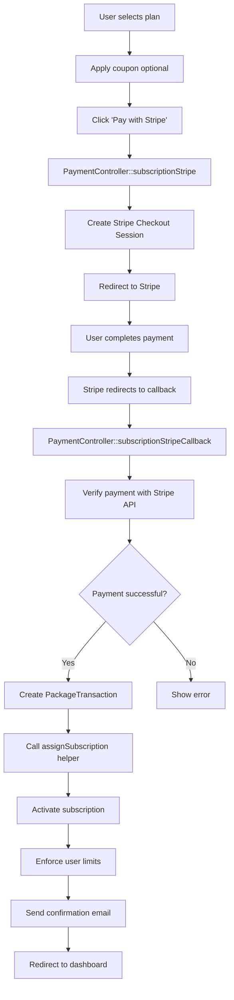
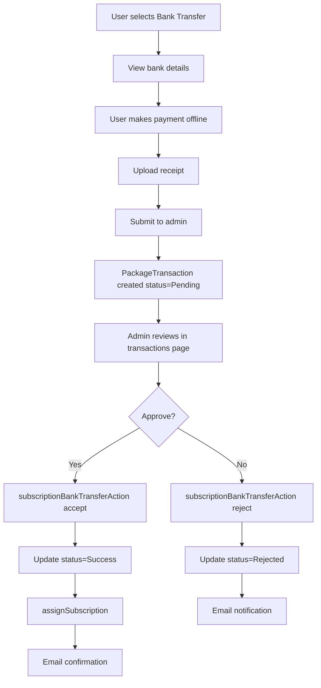

# Payment Integration Guide
## FitHub SaaS - Payment Gateway Implementation

**Version**: 1.0  
**Date**: 2025-11-28  
**Supported Gateways**: 5 (Stripe, PayPal, Bank Transfer, Flutterwave, Paystack)

---

## Overview

### Payment Architecture
- **Controller**: `app/Http/Controllers/PaymentController.php`
- **Model**: `PackageTransaction.php`
- **Purpose**: SaaS subscription payments
- **Currency**: Configurable per gym (stored in settings)

### Supported Payment Methods
1. **Stripe** - Credit/Debit cards (US, global)
2. **PayPal** - PayPal accounts + cards
3. **Bank Transfer** - Manual payment with receipt upload
4. **Flutterwave** - African payments, mobile money
5. **Paystack** - African payments, USSD, bank transfers

---

## 1. Stripe Integration

### 1.1 Installation
```bash
composer require stripe/stripe-php "^7.36"
```

### 1.2 Configuration

**.env**:
```env
STRIPE_KEY=pk_test_...
STRIPE_SECRET=sk_test_...
STRIPE_PAYMENT=on
```

**Settings Table**:
```php
[
    'STRIPE_KEY' => 'pk_test_...',
    'STRIPE_SECRET' => 'sk_test_...',
    'STRIPE_PAYMENT' => 'on',
]
```

### 1.3 Payment Flow



### 1.4 Implementation

**Route**:
```php
GET /subscription/stripe/{id}
GET /subscription/stripe/{id}/callback
```

**Controller Method**:
```php
public function subscriptionStripe(Request $request, $id)
{
    $subscription = Subscription::find($id);
    $couponCode = $request->coupon;
    
    // Apply coupon
    $price = Coupon::couponApply($id, $couponCode);
    
    // Get Stripe settings
    $stripeSetting = subscriptionPaymentSettings();
    \Stripe\Stripe::setApiKey($stripeSetting['STRIPE_SECRET']);
    
    try {
        // Create checkout session
        $session = \Stripe\Checkout\Session::create([
            'payment_method_types' => ['card'],
            'line_items' => [[
                'price_data' => [
                    'currency' => $stripeSetting['CURRENCY'],
                    'product_data' => [
                        'name' => $subscription->title,
                    ],
                    'unit_amount' => $price * 100, // Convert to cents
                ],
                'quantity' => 1,
            ]],
            'mode' => 'payment',
            'success_url' => route('subscription.stripe.callback', [
                'id' => $id,
                'coupon' => $couponCode
            ]),
            'cancel_url' => route('subscription.show', $id),
        ]);
        
        return redirect($session->url);
    } catch (\Exception $e) {
        return redirect()->back()->with('error', $e->getMessage());
    }
}
```

**Callback Handler**:
```php
public function subscriptionStripeCallback(Request $request, $id)
{
    $subscription = Subscription::find($id);
    
    // Retrieve session from Stripe
    \Stripe\Stripe::setApiKey($stripeSetting['STRIPE_SECRET']);
    $session = \Stripe\Checkout\Session::retrieve($request->session_id);
    
    if ($session->payment_status == 'paid') {
        // Create transaction record
        $paymentData = [
            'user_id' => Auth::id(),
            'subscription_id' => $id,
            'amount' => $session->amount_total / 100,
            'transaction_id' => $session->payment_intent,
            'status' => 'Success',
            'payment_type' => 'Stripe',
            'subscription_transactions_id' => $session->id,
        ];
        
        PackageTransaction::transactionData($paymentData);
        
        // Activate subscription
        assignSubscription($id);
        
        return redirect()->route('home')
            ->with('success', 'Subscription activated!');
    }
    
    return redirect()->route('subscription.show', $id)
        ->with('error', 'Payment failed');
}
```

---

## 2. PayPal Integration

### 2.1 Installation
```bash
composer require srmklive/paypal "~3.0"
```

### 2.2 Configuration

**File**: `config/paypal.php`
```php
return [
    'mode' => env('PAYPAL_MODE', 'sandbox'),
    'sandbox' => [
        'client_id' => env('PAYPAL_SANDBOX_CLIENT_ID'),
        'client_secret' => env('PAYPAL_SANDBOX_CLIENT_SECRET'),
    ],
    'live' => [
        'client_id' => env('PAYPAL_LIVE_CLIENT_ID'),
        'client_secret' => env('PAYPAL_LIVE_CLIENT_SECRET'),
    ],
    'currency' => env('PAYPAL_CURRENCY', 'USD'),
];
```

**.env**:
```env
PAYPAL_MODE=sandbox
PAYPAL_SANDBOX_CLIENT_ID=...
PAYPAL_SANDBOX_CLIENT_SECRET=...
paypal_payment=on
```

### 2.3 Implementation

**Route**:
```php
GET /subscription/paypal/{id}
GET /subscription/paypal/{id}/{status}  // success or cancel
```

**Controller Method**:
```php
public function subscriptionPaypal(Request $request, $id)
{
    $subscription = Subscription::find($id);
    $price = Coupon::couponApply($id, $request->coupon);
    
    $paypalSetting = subscriptionPaymentSettings();
    
    // Configure PayPal
    config([
        'paypal.mode' => $paypalSetting['PAYPAL_MODE'],
        'paypal.sandbox.client_id' => $paypalSetting['PAYPAL_CLIENT_ID'],
        'paypal.sandbox.client_secret' => $paypalSetting['PAYPAL_SECRET'],
        'paypal.currency' => $paypalSetting['CURRENCY'],
    ]);
    
    $provider = new \Srmklive\PayPal\Services\PayPal;
    $provider->setApiCredentials(config('paypal'));
    $token = $provider->getAccessToken();
    
    $response = $provider->createOrder([
        "intent" => "CAPTURE",
        "application_context" => [
            "return_url" => route('subscription.paypal.status', [
                $id, 'success', 'coupon' => $request->coupon
            ]),
            "cancel_url" => route('subscription.paypal.status', [
                $id, 'cancel'
            ]),
        ],
        "purchase_units" => [[
            "amount" => [
                "currency_code" => $paypalSetting['CURRENCY'],
                "value" => $price
            ]
        ]]
    ]);
    
    if (isset($response['id'])) {
        foreach ($response['links'] as $link) {
            if ($link['rel'] == 'approve') {
                return redirect($link['href']);
            }
        }
    }
    
    return redirect()->back()->with('error', 'PayPal error');
}
```

**Callback**:
```php
public function subscriptionPaypalStatus(Request $request, $id, $status)
{
    if ($status == 'success') {
        $provider = new \Srmklive\PayPal\Services\PayPal;
        $provider->setApiCredentials(config('paypal'));
        $token = $provider->getAccessToken();
        
        $response = $provider->capturePaymentOrder($request->token);
        
        if (isset($response['status']) && $response['status'] == 'COMPLETED') {
            // Create transaction
            $paymentData = [
                'subscription_id' => $id,
                'amount' => $response['purchase_units'][0]['amount']['value'],
                'transaction_id' => $response['id'],
                'status' => 'Success',
                'payment_type' => 'PayPal',
            ];
            
            PackageTransaction::transactionData($paymentData);
            assignSubscription($id);
            
            return redirect()->route('home')
                ->with('success', 'Subscription activated via PayPal!');
        }
    }
    
    return redirect()->route('subscription.show', $id)
        ->with('error', 'Payment cancelled');
}
```

---

## 3. Bank Transfer

### 3.1 Configuration

**Settings**:
```php
[
    'bank_transfer_payment' => 'on',
    'bank_name' => 'Example Bank',
    'bank_account_holder' => 'Company Name',
    'bank_account_number' => '1234567890',
    'bank_ifsc_code' => 'ABCD0123456',
    'bank_details' => 'Additional instructions',
]
```

### 3.2 Workflow



### 3.3 Implementation

**Upload Receipt**:
```php
public function subscriptionBankTransfer(Request $request, $id)
{
    $validator = Validator::make($request->all(), [
        'receipt' => 'required|file|mimes:pdf,jpg,png|max:5120',
    ]);
    
    if ($validator->fails()) {
        return redirect()->back()->with('error', $validator->errors()->first());
    }
    
    // Upload receipt
    $receiptPath = $request->file('receipt')->store('receipts', 'public');
    
    // Create transaction
    $paymentData = [
        'subscription_id' => $id,
        'amount' => Coupon::couponApply($id, $request->coupon),
        'status' => 'Pending',
        'payment_type' => 'Bank Transfer',
        'receipt' => $receiptPath,
    ];
    
    PackageTransaction::transactionData($paymentData);
    
    return redirect()->route('home')
        ->with('success', 'Receipt uploaded. Awaiting admin approval.');
}
```

**Admin Approval**:
```php
public function subscriptionBankTransferAction(Request $request)
{
    $transaction = PackageTransaction::find($request->id);
    
    if ($request->action == 'accept') {
        $transaction->payment_status = 'Success';
        $transaction->save();
        
        // Activate subscription
        assignSubscription($transaction->subscription_id);
        
        // Send email
        // ...
        
        return redirect()->back()
            ->with('success', 'Payment approved and subscription activated');
    } else {
        $transaction->payment_status = 'Rejected';
        $transaction->save();
        
        return redirect()->back()
            ->with('success', 'Payment rejected');
    }
}
```

---

## 4. Flutterwave Integration

### 4.1 Installation
```bash
composer require flutterwave/flutterwave-v3
```

### 4.2 Configuration

**.env**:
```env
FLW_PUBLIC_KEY=FLWPUBK_TEST-...
FLW_SECRET_KEY=FLWSECK_TEST-...
FLW_SECRET_HASH=...
```

### 4.3 Implementation

**Route**:
```php
GET /subscription/flutterwave/{id}
GET /subscription/flutterwave/{id}/callback
```

**Payment Initiation**:
```php
public function subscriptionFlutterwave(Request $request, $id)
{
    $subscription = Subscription::find($id);
    $price = Coupon::couponApply($id, $request->coupon);
    $flutterwaveSetting = subscriptionPaymentSettings();
    
    $data = [
        'tx_ref' => time(),
        'amount' => $price,
        'currency' => $flutterwaveSetting['CURRENCY'],
        'redirect_url' => route('subscription.flutterwave.callback', $id),
        'customer' => [
            'email' => Auth::user()->email,
            'name' => Auth::user()->name,
        ],
        'customizations' => [
            'title' => $subscription->title,
            'description' => 'Subscription Payment',
        ],
    ];
    
    $curl = curl_init();
    curl_setopt_array($curl, [
        CURLOPT_URL => 'https://api.flutterwave.com/v3/payments',
        CURLOPT_RETURNTRANSFER => true,
        CURLOPT_POST => true,
        CURLOPT_POSTFIELDS => json_encode($data),
        CURLOPT_HTTPHEADER => [
            'Authorization: Bearer ' . $flutterwaveSetting['FLW_SECRET_KEY'],
            'Content-Type: application/json',
        ],
    ]);
    
    $response = curl_exec($curl);
    curl_close($curl);
    
    $result = json_decode($response, true);
    
    if ($result['status'] == 'success') {
        return redirect($result['data']['link']);
    }
    
    return redirect()->back()->with('error', 'Flutterwave error');
}
```

---

## 5. Paystack Integration

### 5.1 Installation
```bash
composer require unicodeveloper/laravel-paystack
```

### 5.2 Configuration

**.env**:
```env
PAYSTACK_PUBLIC_KEY=pk_test_...
PAYSTACK_SECRET_KEY=sk_test_...
```

### 5.3 Implementation

**Verification**:
```php
public function getsubscriptionsPaymentStatus(Request $request, $pay_id, $plan)
{
    $paystackSetting = subscriptionPaymentSettings();
    
    $url = "https://api.paystack.co/transaction/verify/$pay_id";
    
    $ch = curl_init();
    curl_setopt($ch, CURLOPT_URL, $url);
    curl_setopt($ch, CURLOPT_RETURNTRANSFER, 1);
    curl_setopt($ch, CURLOPT_HTTPHEADER, [
        'Authorization: Bearer ' . $paystackSetting['PAYSTACK_SECRET_KEY'],
    ]);
    
    $response = curl_exec($ch);
    curl_close($ch);
    
    $result = json_decode($response, true);
    
    if ($result['status'] && $result['data']['status'] == 'success') {
        // Create transaction
        $paymentData = [
            'subscription_id' => $plan,
            'amount' => $result['data']['amount'] / 100,
            'transaction_id' => $result['data']['reference'],
            'status' => 'Success',
            'payment_type' => 'Paystack',
        ];
        
        PackageTransaction::transactionData($paymentData);
        assignSubscription($plan);
        
        return redirect()->route('home')
            ->with('success', 'Subscription activated via Paystack!');
    }
    
    return redirect()->back()->with('error', 'Payment verification failed');
}
```

---

## 6. Subscription Assignment Logic

### 6.1 Helper Function

**File**: `app/Helper/helper.php`

```php
function assignSubscription($id)
{
    $subscription = Subscription::find($id);
    $user = Auth::user();
    
    if (!$subscription) {
        return ['is_success' => false, 'error' => 'Subscription not found'];
    }
    
    // Update user subscription
    $user->subscription = $subscription->id;
    
    // Calculate expiry date
    switch ($subscription->interval) {
        case 'Monthly':
            $user->subscription_expire_date = Carbon::now()->addMonths(1);
            break;
        case 'Quarterly':
            $user->subscription_expire_date = Carbon::now()->addMonths(3);
            break;
        case 'Yearly':
            $user->subscription_expire_date = Carbon::now()->addYear();
            break;
        case 'Unlimited':
            $user->subscription_expire_date = null;
            break;
    }
    
    $user->save();
    
    // Enforce user limits
    if ($subscription->user_limit > 0) {
        $totalUsers = User::where('parent_id', $user->id)->count();
        
        if ($totalUsers > $subscription->user_limit) {
            // Deactivate excess users
            $usersToDeactivate = User::where('parent_id', $user->id)
                ->orderBy('created_at', 'desc')
                ->skip($subscription->user_limit)
                ->take($totalUsers - $subscription->user_limit)
                ->get();
            
            foreach ($usersToDeactivate as $inactive_user) {
                $inactive_user->is_active = 0;
                $inactive_user->save();
            }
        }
    }
    
    return ['is_success' => true];
}
```

---

## 7. Testing

### 7.1 Stripe Test Cards
```php
// Success
'4242424242424242'  // Visa
'5555555555554444'  // Mastercard

// Decline
'4000000000000002'  // Decline
```

### 7.2 PayPal Sandbox
- Create sandbox accounts at developer.paypal.com
- Use sandbox credentials in `.env`

### 7.3 Flutterwave Test
- Use test keys from dashboard
- Test card: `5531886652142950`, CVV: `564`, PIN: `3310`, OTP: `12345`

### 7.4 Paystack Test
- Test key: `pk_test_...`
- Test card: `4084084084084081`, CVV: `408`, Expiry: `12/24`

---

## 8. Security Considerations

### 8.1 API Keys
- Never commit API keys to version control
- Use environment variables
- Rotate keys regularly

### 8.2 Webhook Verification
- Verify webhook signatures
- Use HTTPS for callbacks
- Implement idempotency

### 8.3 Error Handling
- Log all payment errors
- Don't expose API errors to users
- Implement retry logic

---

**Document Version**: 1.0  
**Last Updated**: 2025-11-28  
**Next Document**: Helper Functions Reference
